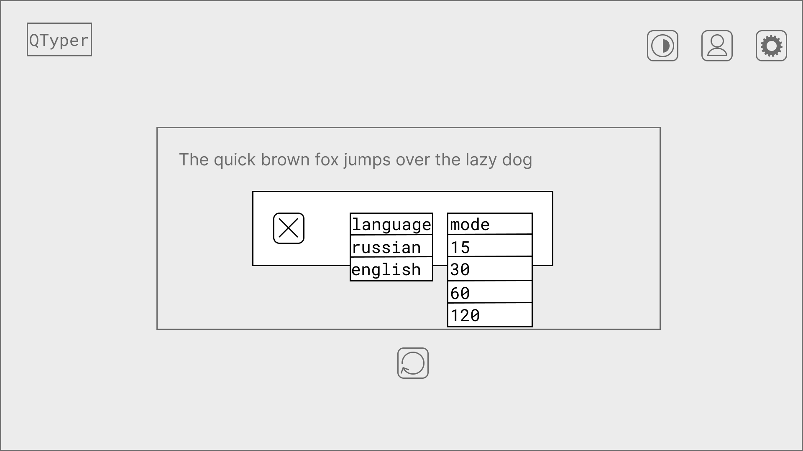

# Техническое задание по разработке приложения с графическим интерфейсом

## Введение

Данное техническое задание описывает требования по разработке приложения с
графическим интерфейсом

## Общие сведения

### Назначение программы

Программа предназначена для тестирования скорости и точности печати

### Используемые технологии

- Язык программирования Python
- Библиотека для создания графических интерфейсов PyQt6
- СУБД SQLite

## Задание

### Требования к функциональным характеристикам

#### Основное окно

- Возможность начать новый тест
    - Выбор режима в секундах: 15/30/60/120
    - Выбор языка набираемых слов: русский/английский
    - Генерация слов в случайном порядке и их отображение
    - Отображение верности введенного символа
- Расчет скорости и точности печати
- Создание линейной диаграммы на основе полученных данных
- Сохранение данных в базу данных
- Кнопка для смены цветовой схемы (со светлой на тёмную и наоборот)
- Кнопка для перехода в окно локального профиля
- Кнопка для открытия окна настроек теста

#### Окно локального профиля

- Отображение линейной диаграммы на основе всех тестов
- Кнопка для выгрузки данных из базы данных в формате *.csv
    - Отображать диалоговое окно для выбора пути для сохранения файла
- Кнопка для очистки истории всех пройденных тестов.
    - Отображать всплывающее окно с вопросом "Удалить все данные?"
        - Кнопка "удалить"
            - Удалять все данные из базы данных при нажатии на кнопку
            - Закрыть всплывающее окно
        - Кнопка "отменить"
            - Закрыть всплывающее окно при нажатии на кнопку
    
#### Окно настроек тест

- Кнопка закрытия окна
- Выпадающее меню для выбора режима теста
- Выпадающее меню для выбора языка

### Требования к дизайну

#### Основное окно приложения

- Левый верхний угол
    - Название программы: “QTyper”
- Посередине необходимо расположить сгенерированные слова
- Правый верхний угол
    - Кнопка смены цветовой схемы
    - Кнопка для перехода в окно локального профиля
    - Кнопка для перехода в окно настроек теста

  

#### Окно локального профиля

- Левый верхний угол
    - Кнопка округлой формы для возврата в основное окно 
- Центр
    - Линейная диаграмма на основе всех пройденных тестах
- Верхний правый угол
    - Кнопка для выгрузки данных из базы данных в формате *.csv
    - Кнопка для очистки истории всех пройденных тестов

  

#### Всплывающее окно при нажатии на кнопку очистки

- Всплывающее окно при нажатии на кнопку очистки
    - Сверху необходимо расположить вопрос: “Удалить все данные?”
    - Снизу расположить две прямоугольные кнопки
        - Удалить
            - Кнопка должна быть красного цвета
        -  Отменить
            - нопка должна быть нейтрального цвета (в цвет интерфейса)

  

#### Окно настроек теста

- Левый верхний угол
    - Кнопка округлой формы для закрытия окна
- Центр
    - Справа расположить выпадающее меню для выбора режима теста
    - Слева расположить выпадающее меню для выбора языка
